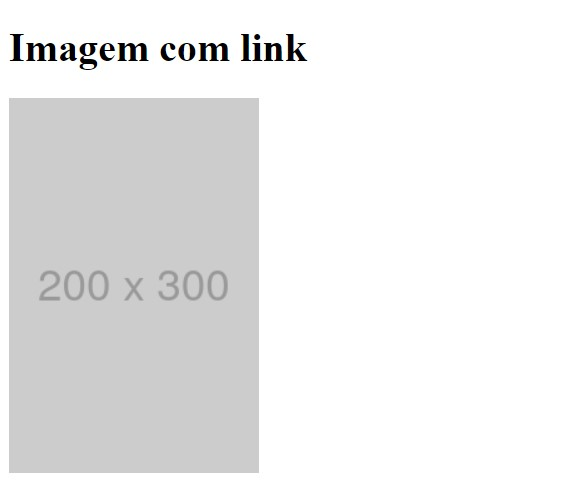

# Imagem com Link
Projeto de um exercício proposto para mostar o uso de uma imagem de placeholder atrelada ao link do site do Google usando HTML.

## Exercício Proposto

Crie uma imagem com link externo:

- Essa âncora deve ter um link externo para o site https://google.com. O site do Google deve abrir em uma nova aba do navegador.

- Use uma imagem de placeholder de tamanho 200x300.
(pode usar o https://placeholder.com/ para a imagem, se ele não funcionar, pode usar ohttps://placekitten.com/ ou outro site de placeholder de imagens)

## Resultado Final

## Tecnologia Utilizada
- HTML